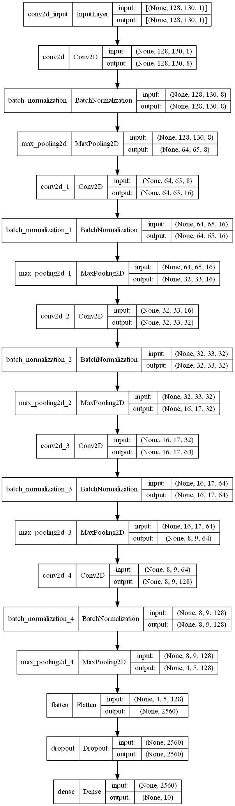
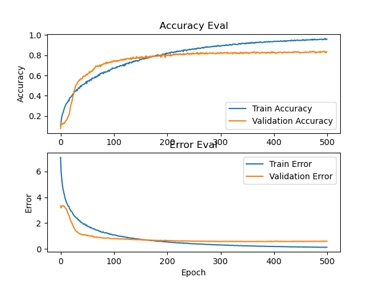

# INFOMPR
## Results
### Accuracy
- Train Accuracy: 0.9810838103294373
- Validation Accuracy: 0.83868
- Test Accuracy: 0.8538538813591003

### Model Graph

### Graph

## Planning
| What                        | Who?                          | When?                  | Done? |
|-----------------------------|-------------------------------|------------------------|-------|
| Proposal                    | Everyone                      | Week 0                 | ✔️     |
| Related works               | Dani                          | Week 1                 | ✔️     |
| Exploratory data analysis   | Zwierd, Dani                  | Week 1                 | ✔️     |
| Data (pre-)processing       | Tim, Zwierd, Floris           | Week 2                 | ✔️     |
| Feature research            | Stephan, Sander               | Week 2                 | ✔️     |
| Feature implementation      | Tim, Stephan, Zwierd, Sander  | Week 3-4               | ✔️     |
| Network implementation      | Tim, Stephan, Sander          | Week 3-4               | ✔️     |
| Preliminary result analysis | Stephan, Sander, Floris       | Week 5                 | ❌     |
| Presentation                | Everyone                      | Week 5 (January 26/28) | ❌     |
| Report                      | Everyone (Specific tasks TBD) | Week 1-6               | ❌     |

## Links
### Project Proposal
https://docs.google.com/document/d/12bgSXgWeG1kOhOga1HIjOZi6InBZ5AKl1IpCE2W8EtI/edit?usp=sharing

### Overleaf
https://www.overleaf.com/2427315548yrrshzwpfhff
